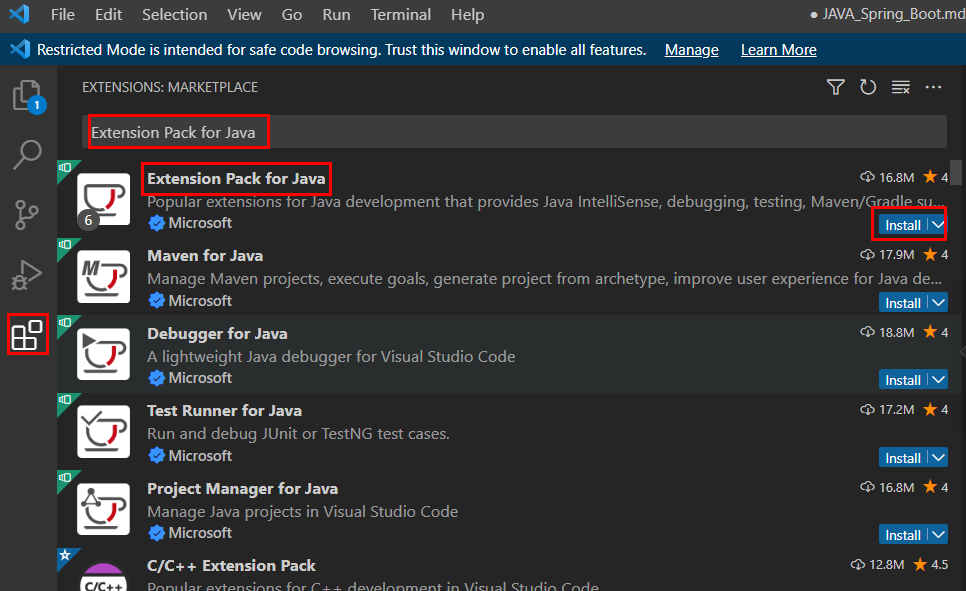
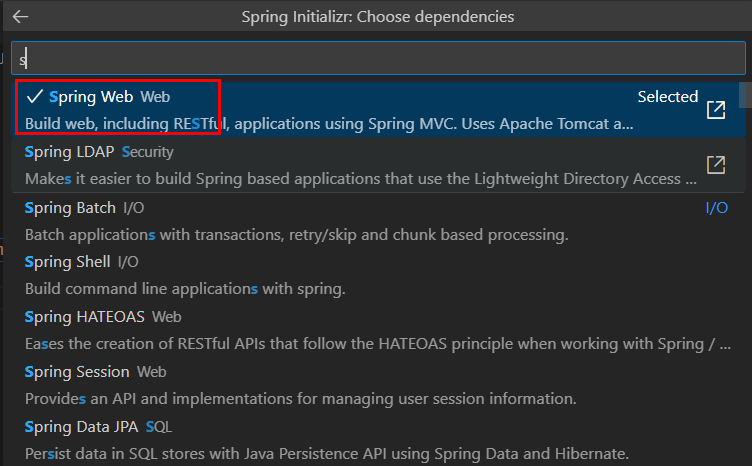
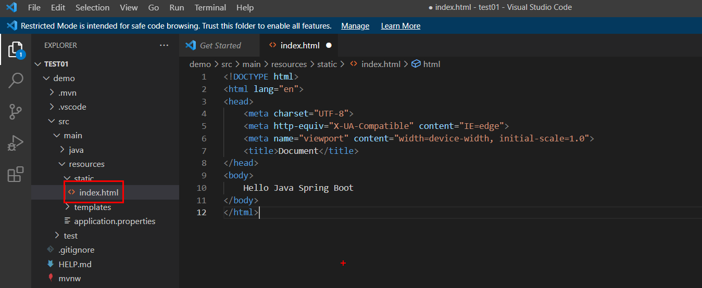
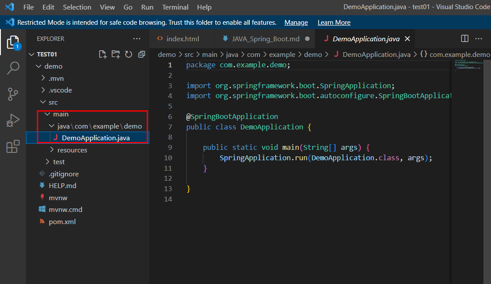

# JAVA SPRING BOOT
## 설치하기
### VS Code를 이용해 Spring Boot 설치
 
 

## Spring Boot 프로젝트 생성
단축키 `[Ctrl] + [Shift] + [P]` 입력해서 `[Command Palette]`을 실행한 후 `Spring Initializr`을 입력하여 Maven/Gradle 중 선택해주면(작성자는 Maven을 선택) 다음과 같은 과정이 나온다.
 
- 스프링 부트 버전 
   
- 프로젝트 언어 
   
- Group ID 
   
- Artifact ID 
   
- 패키지 타입 
   
- 자바 버전 
   
- 추가 라이브러리 설치
   
  이 작업은 나중에 해도 상관은 없다. 하지만 미리 설치해두면 생성시 자동으로 설정해준다. 

## Spring Boot 프로젝트 실행해보기
### Index 파일 생성
 
`static` 폴더 안에 `index.html`파일을 새로 생성해준다.(`!`(느낌표)를 입력하면 html 기본 소스를 자동으로 입력해준다.)

### 실행
`demo/src/main/java.com.example.demo/SpringBootApplication.java` 클릭 후 `Run Java` 클릭으로 실행해준다. 
 
 

### 확인
내 주소:8080(http://localhost:8080/)에 접속해보면 `index.html` 파일이 실행되는걸 확인 할 수 있다. 
 