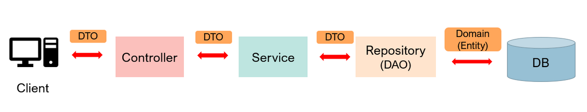

# Spring Boot 기본 개념
## 스프링 부트 전체적 구조
<br/>

### Entity
Entity는 DB안에 있는 테이블의 Column들을 필드로 가지는 객체를 뜻한다. Entity와 DB는 1:1 대응이며, 테이블에 존재하지 않는 칼럼을 필드로 가져서는 안된다.<br/>

#### Entity 예시
연결된 DB board라는 테이블 안에 id, title, contens 칼럼이 있다고 하면<br/>
```java
@Entity(name = "board")
public class Board {
    @Id
    private Long id;
    private String title;
    private String contents;
}
```
Entity 클래스 Board는 다음과 같이 테이블과 대응하는 필드들만 가져야 한다.<br/>

### DAO(Data Access Object)
DAO는 실제 DB에 접근하는 객체를 뜻한다. DB에서 데이터 입,출력을 여기서 담당한다. JPA를 이용할 경우 비슷한 열할을 하는 Repository가 쓰인다. <br/>

### DTO(Data Transfer Object)
데이터를 이동하기 위한 객체다. Client가 Controller에 요청을 보낼 때도 RequestDto의 형식으로 데이터가 이동하고, Controller가 Client에게 응답을 보낼 때도 ResponseDto의 형태로 데이터를 보내게 된다.

#### DTO를 사용하는 이유
DB에서 가저온 데이터를 Entity에 담아서 그대로 사용하지 않고 DTO를 사용할까?<br/>

- View Layer와 DB Layer의 분리
- 테이블과 직접적으로 매핑되는 Entity 클래스가 변경되면 여러 클래스에서 영향이 갈 수 있다.


### Controller
Client의 요청을 DTO의 형태로 받아 Service의 기능을 호출하고 그 결과 값을 DTO의 형태로 반환하는 역할을 한다.

### Service
Controller에서 받은 DTO를 통해 여러 로직들을 처리하고, DAO(또는 Repository)를 통해 DB에 접근해 데이터를 관리한다.

