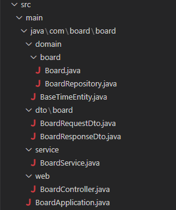

# Spring_Boot 실습
## 개발 환경
- Spring boot 3.0.1
- JAVA 19
- Gradle
- Jar
- MariaDB
- Thymeleaf
- JPA
- Lombok

`build.gradle` <br/>
```gradle
dependencies {
	implementation 'org.springframework.boot:spring-boot-starter-data-jpa'
	implementation 'org.springframework.boot:spring-boot-starter-thymeleaf'
	implementation 'org.springframework.boot:spring-boot-starter-web'
	compileOnly 'org.projectlombok:lombok'
	runtimeOnly 'org.mariadb.jdbc:mariadb-java-client'
	annotationProcessor 'org.projectlombok:lombok'
	testImplementation 'org.springframework.boot:spring-boot-starter-test'
	developmentOnly 'org.springframework.boot:spring-boot-devtools'
}
```

## DB 설정
### 테이블 생성
```sql
CREATE TABLE IF NOT EXISTS `board` (
  `id` bigint(20) NOT NULL AUTO_INCREMENT COMMENT 'PK',
  `title` varchar(200) NOT NULL COMMENT '제목',
  `content` text NOT NULL COMMENT '내용',
  `read_cnt` int(11) NOT NULL DEFAULT 0 COMMENT '조회수',
  `register_id` VARCHAR(100) NOT NULL COMMENT '작성자',
  `register_time` DATETIME NULL DEFAULT NULL COMMENT '작성일',
  `update_time` DATETIME NULL DEFAULT NULL COMMENT '수정일',
  PRIMARY KEY (`id`)
) ENGINE=InnoDB DEFAULT CHARSET=utf8mb3 COMMENT='게시판';
```

### DB 연동
`application.yml`
```yml
spring:
  datasource:
    driverClassName: org.mariadb.jdbc.Driver
    url: jdbc:mariadb://db주소:포트번호/db이름?serverTimezone=UTC&characterEncoding=UTF-8
    username: 아이디
    password: 비밀번호

## 템플랫 경로 설정
  thymeleaf:
    prefix: file:src/main/resources/templates/
    cache: false
```

## 게시판 구현
### 전체구조
<br/>
- `BoardRequestDto.java` : 게시판 요청데이터 담당
- `BoardResponseDto.java` : 게시판 응답 데이터 담당
- `BaseTimeEntity.java` : 공동으로 쓰이는 날짜 데이터 담당
- `Board.java` : board 테이블의 Entity
- `BoardRepository.java` : JpaRepository 인터페이스 담당
- `BoardService.java` : 게시판의 Service

### DTO
#### BoardRequestDto
게시물 등록, 게시물 수정, 게시물 상세 조회에 필요한 필드를 정의한다.<br/>
`toEntity()` 메서드는 `board/Board.java`의 Entity를 이용한다.<br/>

`dto/board/BoardRequestDto.java`<br/>
```java
import com.board.board.domain.board.Board;

import lombok.Getter;
import lombok.NoArgsConstructor;
import lombok.Setter;

@Getter
@Setter
@NoArgsConstructor
public class BoardRequestDto {
	private Long id;
	private String title;
	private String content;
	private String registerId;
	
	public Board toEntity() {
		return Board.builder()
			.title(title)
			.content(content)
			.registerId(registerId)
			.build();
	}
	
	@Override
	public String toString() {
		return "BoardRequestDto [id=" + id + ", title=" + title + ", content=" + content + ", registerId=" + registerId
				+ "]";
	}
}
```


#### BoardResponseDto
`board/Board.java`를 `BoardResponseDto`에 맞게 변환하는 생성자를 생성한다.<br/>

`dto/board/BoardResponseDto.java`<br/>
```java
import java.time.LocalDateTime;
import java.time.format.DateTimeFormatter;
import java.util.Optional;
import com.board.board.domain.board.Board;
import lombok.Getter;

@Getter
public class BoardResponseDto {
	private Long id;
	private String title;
	private String content;
	private int readCnt;
	private String registerId;
	private LocalDateTime registerTime;

	public BoardResponseDto(Board entity) {
		this.id = entity.getId();
		this.title = entity.getTitle();
		this.content = entity.getContent();
		this.readCnt = entity.getReadCnt();
		this.registerId = entity.getRegisterId();
		this.registerTime = entity.getRegisterTime();
	}

	@Override
	public String toString() {
		return "BoardListDto [id=" + id + ", title=" + title + ", content=" + content + ", readCnt=" + readCnt
				+ ", registerId=" + registerId + ", registerTime=" + registerTime + "]";
	}

    public String getRegisterTime() {
		return toStringDateTime(this.registerTime);
	}
	
    public static String toStringDateTime(LocalDateTime localDateTime) {
        DateTimeFormatter formatter = DateTimeFormatter.ofPattern("yyyy-MM-dd HH:mm:ss");
        return Optional.ofNullable(localDateTime)
                .map(formatter::format)
                .orElse("");
    }
}
```

### Domain
#### BaseTimeEntity
Entity에서 공통으로 사용할 날짜 필드를 관리할 클래스를 정의한다.<br/>
`domain/BaseTimeEntity.java`
```java
import java.time.LocalDateTime;

import jakarta.persistence.EntityListeners;
import jakarta.persistence.MappedSuperclass;

import org.springframework.data.annotation.CreatedDate;
import org.springframework.data.annotation.LastModifiedDate;
import org.springframework.data.jpa.domain.support.AuditingEntityListener;

import lombok.Getter;

@Getter
@MappedSuperclass
@EntityListeners(AuditingEntityListener.class)
public class BaseTimeEntity {
	
	@CreatedDate
	private LocalDateTime registerTime;
	
	@LastModifiedDate
	private LocalDateTime	updateTime;
}
```
#### BoardEntity
게시판에 사용할 Entity를 정의한다. 만약 클래스 이름과 테이블 이름이 다를경우 `@Entity(name="테이블명")`으로 설정해준다.<br/>

`domain/board/Board.java`<br/>
```java
import jakarta.persistence.Entity;
import jakarta.persistence.GeneratedValue;
import jakarta.persistence.GenerationType;
import jakarta.persistence.Id;

import com.board.board.domain.BaseTimeEntity;

import lombok.AccessLevel;
import lombok.Builder;
import lombok.Getter;
import lombok.NoArgsConstructor;


@NoArgsConstructor(access = AccessLevel.PROTECTED)
@Getter
@Entity
public class Board extends BaseTimeEntity {
	
	@Id
	@GeneratedValue(strategy = GenerationType.IDENTITY)
	private Long id;
	private String title;
	private String content;
	private int readCnt;
	private String registerId;
	
	@Builder
	public Board(Long id, String title, String content, int readCnt, String registerId) {
		this.id = id; 
		this.title = title;
		this.content = content;
		this.readCnt = readCnt;
		this.registerId = registerId;
	}
}
```

#### BoardRepository
Jpa를 상속받아 CRUD의 기능을 담당하는 인터페이스를 생성한다.<br/>
`domain/board/BoardRepository.java`<br/>
```java
import org.springframework.data.jpa.repository.JpaRepository;
import org.springframework.data.jpa.repository.Modifying;
import org.springframework.data.jpa.repository.Query;
import org.springframework.data.repository.query.Param;
import org.springframework.transaction.annotation.Transactional;

import com.board.board.dto.board.BoardRequestDto;

public interface BoardRepository extends JpaRepository<Board, Long> {
	
	static final String UPDATE_BOARD = "UPDATE Board "
			+ "SET TITLE = :#{#boardRequestDto.title}, "
			+ "CONTENT = :#{#boardRequestDto.content}, "
			+ "UPDATE_TIME = NOW() "
			+ "WHERE ID = :#{#boardRequestDto.id}";
	
	static final String UPDATE_BOARD_READ_CNT_INC = "UPDATE Board "
			+ "SET READ_CNT = READ_CNT + 1 "
			+ "WHERE ID = :id";
	
	static final String DELETE_BOARD = "DELETE FROM Board "
			+ "WHERE ID IN (:deleteList)";
	
	@Transactional
	@Modifying
	@Query(value = UPDATE_BOARD, nativeQuery = true)
	public int updateBoard(@Param("boardRequestDto") BoardRequestDto boardRequestDto);
	
	@Transactional
	@Modifying
	@Query(value = UPDATE_BOARD_READ_CNT_INC, nativeQuery = true)
	public int updateBoardReadCntInc(@Param("id") Long id);
	
	@Transactional
	@Modifying
	@Query(value = DELETE_BOARD, nativeQuery = true)
	public int deleteBoard(@Param("deleteId") Long[] deleteList);
}
```

### Service
게시판 기능을 담당할 Service 클래스를 생성한다.<br/>
`board/service/BoardService.java`<br/>
```java
import java.util.HashMap;
import java.util.stream.Collectors;

import org.springframework.data.domain.Page;
import org.springframework.data.domain.PageRequest;
import org.springframework.stereotype.Service;
import org.springframework.transaction.annotation.Transactional;

import com.board.board.dto.board.BoardResponseDto;
import com.board.board.dto.board.BoardRequestDto;
import com.board.board.domain.board.Board;
import com.board.board.domain.board.BoardRepository;

import lombok.RequiredArgsConstructor;

@RequiredArgsConstructor
@Service
public class BoardService {

	private final BoardRepository boardRepository;
	
	@Transactional
	public Long save(BoardRequestDto boardSaveDto) {
		return boardRepository.save(boardSaveDto.toEntity()).getId();
	}
	
	@Transactional(readOnly = true)
	public HashMap<String, Object> findAll(Integer page, Integer size) {
		
		HashMap<String, Object> resultMap = new HashMap<String, Object>();
		
		Page<Board> list = boardRepository.findAll(PageRequest.of(page, size));
		
		resultMap.put("list", list.stream().map(BoardResponseDto::new).collect(Collectors.toList()));
		resultMap.put("paging", list.getPageable());
		resultMap.put("totalCnt", list.getTotalElements());
		resultMap.put("totalPage", list.getTotalPages());
		
		return resultMap;
	}
	
	public BoardResponseDto findById(Long id) {
		return new BoardResponseDto(boardRepository.findById(id).get());
	}
	
	public int updateBoard(BoardRequestDto boardRequestDto) {
		return boardRepository.updateBoard(boardRequestDto);
	}
	
	public void deleteById(Long id) {
		boardRepository.deleteById(id);
	}
	
}
```

### Application
JPA에서 Auditing을 가능하게 하는 어노테이션을 추가 한다.<br/>
`BoardApplication.java`<br/>
```java
import org.springframework.boot.SpringApplication;
import org.springframework.boot.autoconfigure.SpringBootApplication;
import org.springframework.data.jpa.repository.config.EnableJpaAuditing;  //추가

@EnableJpaAuditing  // 추가
@SpringBootApplication
public class BoardApplication {

	public static void main(String[] args) {
		SpringApplication.run(BoardApplication.class, args);
	}

}
```
### Controller
명령에 따른 서비스 호출 처리를 해준다.<br/>
`BoardController.java` <br/>
```java
import org.springframework.stereotype.Controller;
import org.springframework.ui.Model;
import org.springframework.web.bind.annotation.GetMapping;
import org.springframework.web.bind.annotation.PostMapping;
import org.springframework.web.bind.annotation.RequestParam;

import com.board.board.dto.board.BoardRequestDto;
import com.board.board.service.BoardService;

import lombok.RequiredArgsConstructor;

@RequiredArgsConstructor
@Controller
public class BoardController {
	
	private final BoardService boardService;
	
	@GetMapping("/board/list")
	public String getBoardListPage(Model model
			, @RequestParam(required = false, defaultValue = "0") Integer page
			, @RequestParam(required = false, defaultValue = "5") Integer size) throws Exception {
		
		try {
			model.addAttribute("resultMap", boardService.findAll(page, size));
		} catch (Exception e) {
			throw new Exception(e.getMessage()); 
		}
		
		return "/board/list";
	}
	
	@GetMapping("/board/write")
	public String getBoardWritePage(Model model, BoardRequestDto boardRequestDto) {
		return "/board/write";
	}
	
	@GetMapping("/board/view")
	public String getBoardViewPage(Model model, BoardRequestDto boardRequestDto) throws Exception {
		
		try {
			if (boardRequestDto.getId() != null) {
				model.addAttribute("info", boardService.findById(boardRequestDto.getId()));
			}
		} catch (Exception e) {
			throw new Exception(e.getMessage()); 
		}
		
		return "/board/view";
	}
	
	@PostMapping("/board/write/action")
	public String boardWriteAction(Model model, BoardRequestDto boardRequestDto) throws Exception {
		
		try {
			Long result = boardService.save(boardRequestDto);
			
			if (result < 1) {
				throw new Exception("#Exception boardWriteAction!");
			}
		} catch (Exception e) {
			throw new Exception(e.getMessage()); 
		}
		
		return "redirect:/board/list";
	}
	
	@PostMapping("/board/view/action")
	public String boardViewAction(Model model, BoardRequestDto boardRequestDto) throws Exception {
		
		try {
			int result = boardService.updateBoard(boardRequestDto);
			
			if (result < 1) {
				throw new Exception("#Exception boardViewAction!");
			}
		} catch (Exception e) {
			throw new Exception(e.getMessage()); 
		}
		
		return "redirect:/board/list";
	}
	
	@PostMapping("/board/view/delete")
	public String boardViewDeleteAction(Model model, @RequestParam() Long id) throws Exception {
		
		try {
			boardService.deleteById(id);
		} catch (Exception e) {
			throw new Exception(e.getMessage()); 
		}
		
		return "redirect:/board/list";
	}
}
```

### FrontEnd
`list.html` <br/>
```html
<!DOCTYPE html>
<html xmlns:th="http://www.thymeleaf.org">
<head>
	<title>Board List</title>
	<meta charset="UTF-8">
	<meta name="viewport" content="width=device-width, initial-scale=1" />
	<!--부트스트랩 css 추가-->
    <link rel="stylesheet" href="/css/lib/bootstrap.min.css">
</head>
<body>
	<div id="wrapper">
		<div class="container">
	    	<form action="/board/list" id="frm" method="get">
			    <div class="col-md-12 mt-4">
			        <button type="button" class="btn btn-primary" onclick="javascript:location.href='/board/write'">Register</button>
			        <table class="table table-striped table-horizontal table-bordered mt-3">
			            <thead class="thead-strong">
			                <tr>
			                    <th width="10%">게시글번호</th>
			                    <th width="">제목</th>
			                    <th width="20%">작성자</th>
			                    <th width="10%">조회수</th>
			                    <th width="20%">작성일</th>
			                </tr>
			            </thead>
			            <tbody id="tbody">
			            	<tr th:each="list,index : ${resultMap.list}" th:with="paging=${resultMap.paging}">
								<td>
									<span th:text="${(resultMap.totalCnt - index.index) - (paging.pageNumber * paging.pageSize)}"></span>
								</td>
								<td>
									<a th:href="@{./view(id=${list.id})}"><span th:text="${list.title}"></span></a>
								</td>
								<td>
									<span th:text="${list.registerId}"></span>
								</td>
								<td>
									<span th:text="${list.readCnt}"></span>
								</td>
								<td>
									<span th:text="${list.registerTime}"></span>
								</td>
							<tr>
			            </tbody>
			        </table>
			        <div class="row">
						<div class="col">
							<ul class="pagination">
								<li class="page-item" th:each="index : ${#numbers.sequence(1, resultMap.totalPage)}" th:with="paging=${resultMap.paging}">
									<a class="page-link" th:classappend="${paging.pageNumber ==  (index-1)} ? bg-primary : bg-secondary" th:href="@{./list(page=${index - 1},page=${paging.pageSize})}">
										<span class="text-white" th:text="${index}"></span>
									</a>
								</li>
							</ul>
						</div>
					</div>
			    </div>
		    </form>
	    </div>
    </div>
    <!--부트스트랩 js, jquery 추가-->
    <script src="/js/lib/jquery.min.js"></script>
    <script src="/js/lib/bootstrap.min.js"></script>
</body>
</html>
```

`view.html` <br/>
```html
<!DOCTYPE html>
<html xmlns:th="http://www.thymeleaf.org">
<head>
	<title>Board List</title>
	<meta charset="UTF-8">
	<meta name="viewport" content="width=device-width, initial-scale=1" />
	<!--부트스트랩 css 추가-->
    <link rel="stylesheet" href="/css/lib/bootstrap.min.css">
</head>
<body>
	<div class="container">
		<h1>Board View.</h1>
		<form id="frm" action="/board/view/action" method="post">
			<input type="hidden" name="id" th:value="${info.id}">
			<div class="mb-3">
			    <label class="form-label">Title.</label>
			    <input type="text" class="form-control" name="title" th:value="${info.title}">
			</div>
			<div class="mb-3">
		    	<label class="form-label">Content</label>
		    	<textarea class="form-control" rows="5" cols="" name="content" th:text="${info.content}"></textarea>
			</div>
			<div class="mb-3">
			    <label class="form-label">Writer.</label>
			    <input type="text" class="form-control" name="registerId" th:value="${info.registerId}">
			</div>
			<div class="float-left">
				<button type="button" class="btn btn-success" onclick="javascript:location.href='/board/list'">Previous</button>
				<button type="submit" class="btn btn-primary">Edit</button>
			</div>
			<div class="float-right">
				<button type="button" class="btn btn-danger" th:onclick="fnViewDelete()">Delete</button>
			</div>
		</form>
	</div>
    <!--부트스트랩 js, jquery 추가-->
    <script src="/js/lib/jquery.min.js"></script>
    <script src="/js/lib/bootstrap.min.js"></script>
    <script th:inline="javascript">
		function fnViewDelete() {
			if (confirm("Do you want to delete it?")) {
				let frm = $("#frm");
				frm.attr("action","/board/view/delete");
				frm.submit();
			}
		}
	</script>
</body>
</html>
```

`write.html`
```html
<!DOCTYPE html>
<html xmlns:th="http://www.thymeleaf.org">
<head>
	<title>Board List</title>
	<meta charset="UTF-8">
	<meta name="viewport" content="width=device-width, initial-scale=1" />
	<!--부트스트랩 css 추가-->
    <link rel="stylesheet" href="/css/lib/bootstrap.min.css">
</head>
<body>
	<div class="container">
		<h1>Board Register.</h1>
		<form action="/board/write/action" method="post">
			<div class="mb-3">
			    <label for="exampleInputEmail1" class="form-label">Title.</label>
			    <input type="text" class="form-control" id="" name="title">
			</div>
			<div class="mb-3">
		    	<label for="exampleInputPassword1" class="form-label">Content</label>
		    	<textarea class="form-control" rows="5" cols="" name="content"></textarea>
			</div>
			<div class="mb-3">
			    <label for="exampleInputEmail1" class="form-label">Writer.</label>
			    <input type="text" class="form-control" id="" name="registerId">
			</div>
			<button type="button" class="btn btn-success" onclick="javascript:location.href='/board/list'">Previous</button>
			<button type="submit" class="btn btn-primary">Submit</button>
		</form>
	</div>
    <!--부트스트랩 js, jquery 추가-->
    <script src="/js/lib/jquery.min.js"></script>
    <script src="/js/lib/bootstrap.min.js"></script>
</body>
</html>
```